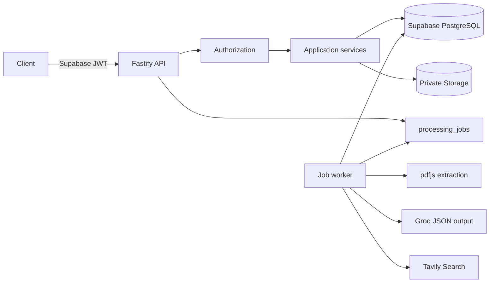

# Backend architecture

VC Brain is a Fastify TypeScript service backed by Supabase PostgreSQL and private Supabase Storage. API handlers validate and authorize requests, application services implement bounded operations, repositories isolate persistence, and a database-backed worker advances resumable jobs. No frontend code is included.

## Boundaries

- `src/server/application` creates applications atomically through `create_vc_application`.
- `documents` validates, stores, and extracts PDFs; it never writes raw bytes to PostgreSQL.
- `diligence` owns claim extraction, thesis screening, four rubric services, verification, economics, and orchestration.
- `evidence` owns provenance, deterministic quality/confidence, and source deduplication.
- `scoring` calculates the official score and recommendation without LLM control.
- `memos` creates a draft, adversarial review, final revision, and gap-specific requests.
- `decisions` records immutable human outcomes after explicit authorization.
- `jobs` claims work with `FOR UPDATE SKIP LOCKED`, applies bounded retries, and retains errors.

Expected stages are `submitted → extracting → claims_ready → screened → diligence_running → evidence_ready → memo_draft → memo_ready`. Terminal human states are `approved`, `passed`, and `needs_more_info`; failed jobs set `failed`, from which controlled retries are allowed. `stage-runner.ts` contains the application transition guard and the existing database function atomically synchronizes stage events.

Errors use `{ error: { code, message, details?, requestId? } }`. Production responses omit stacks. Service-role operations first authenticate a Supabase user, load the profile, enforce roles, and verify owner/organization access. Internal job execution requires `X-Worker-Token`.

Migration `011_backend_atomic_operations.sql` adds only two RPCs: atomic application creation and locked job claiming. It does not alter existing tables.
